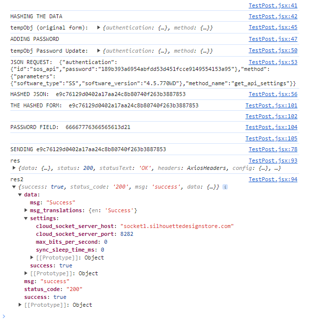

# Api

Good results are in TestPost.jsx
Lib results are in Post2.jsx
Bad results in PostRequest.jsx

1. Create a list from the 'Slices'

```js
const slices = [
  'UOCjn',
  '{t\\K_]|{]l|',
  'XCgdFCOroCe[nd',
  'l\\{qgS',
  'MJQUJn|xWXvAPX',
  'SicaN',
  '\\wItxsSCfC',
  'FadP{Vj^',
  'QRBLIBHCYv',
  'emfdZ',
];
```

2. Hash each slice using 'SHA1' algorithm
3. Take the first 2 characters from the start of each hashed slice
4. Add the characters sequentially to create a new string.
5. Take this completed string and add it to the password field of the request template

```js
const [requestData, setRequestData] = useState({
  authentication: {
    id: 'sos_api',
    password: '189b393a6954abfdd53d451fcce9149554153a95', // Add here
  },
  method: {
    parameters: { software_type: 'SS', software_version: '4.5.770WD' },
    method_name: 'get_api_settings',
  },
});
```

6. Convert this object into JSON object
7. Hash this JSON object using the 'SHA1' algorithm
8. Add this hash to the password field of the original request object


9.  Send output as request body using a POST request.

## Results from TestPost.jsx




Assuming this is the correct response from the server for the api. We can see that the slice hashing is returning a different result from the string password i was sent to use.


SLICE:  UOCjn
HASHED SLICE:  6661e5fff96652fd39cb697cb0c1fd5330e2d871
CHARS:  66
PASS STRING:  66

SLICE:  {t\K_]|{]l|
HASHED SLICE:  665524d9e0390ffc55f91029a5c0a4cc6e74596a
CHARS:  66
PASS STRING:  6666

SLICE:  XCgdFCOroCe[nd
HASHED SLICE:  7761bc060317fe25081c4491ca7de08a751d8ec7
CHARS:  77
PASS STRING:  666677

SLICE:  l\{qgS
HASHED SLICE:  76759518e6623055c6db2d3a40bbb4197fcd1faa
CHARS:  76
PASS STRING:  66667776

SLICE:  MJQUJn|xWXvAPX
HASHED SLICE:  362129cb7a539dd3a45c47e49f04e9021ba9b556
CHARS:  36
PASS STRING:  6666777636

SLICE:  SicaN
HASHED SLICE:  6564810887d9f9ba49f396a470aa03208d0040f7
CHARS:  65
PASS STRING:  666677763665

SLICE:  \wItxsSCfC
HASHED SLICE:  6558db682f139dfc9e7ebcf6c473cf42c992308c
CHARS:  65
PASS STRING:  66667776366565

SLICE:  FadP{Vj^
HASHED SLICE:  6121ee3b681e36a79844428ff8dc5ae13a41c6c6
CHARS:  61
PASS STRING:  6666777636656561

SLICE:  QRBLIBHCYv
HASHED SLICE:  3d559f03d399d2b328e668e76e839ce76f70bfc3
CHARS:  3d
PASS STRING:  66667776366565613d

SLICE:  emfdZ
HASHED SLICE:  2155ea98c4252c1fcea809c38decc8d008b5c7c0
CHARS:  21
PASS STRING:  66667776366565613d21

hashedPass:  0f362df2e0ab124dab7a6a4e7fb8c1790ba8c7c7

main.7c7da6fed4be7941efb1.hot-update.js:60 NEW PASSWORD:  66667776366565613d21
main.7c7da6fed4be7941efb1.hot-update.js:123 THE HASHED FORM:  {}
main.7c7da6fed4be7941efb1.hot-update.js:124 
main.7c7da6fed4be7941efb1.hot-update.js:125 PASSWORD FIELD:  66667776366565613d21